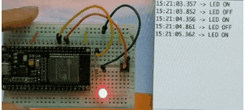
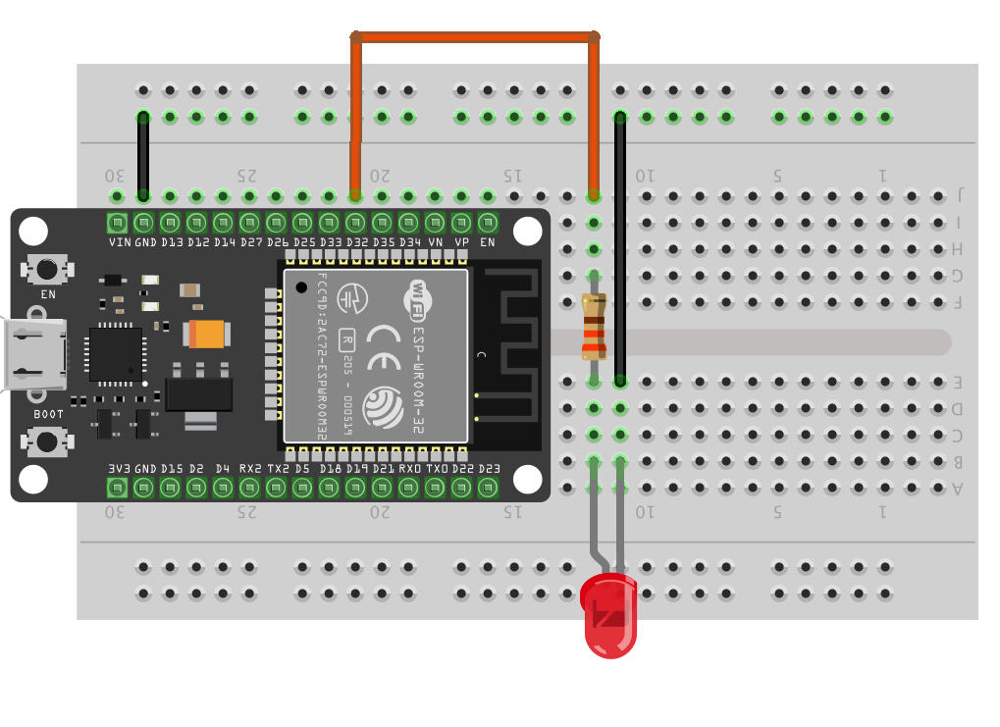
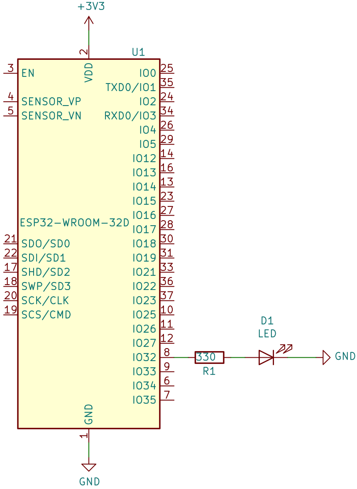

# 02-Blinky

## Lesson Objectives
1. Connect an LED
2. Blink from the LED

## Program behaviour

1. Blink LED and 500ms interval
2. Send serial text `LED ON` and `LED OFF`.

## Connecting the LED

Note that the 3V3 and GND positions on the actual board might be in different positions.

## Programming and usage
After uploading and compiling the code. The LED should blink with serial console output as shown in the image.

