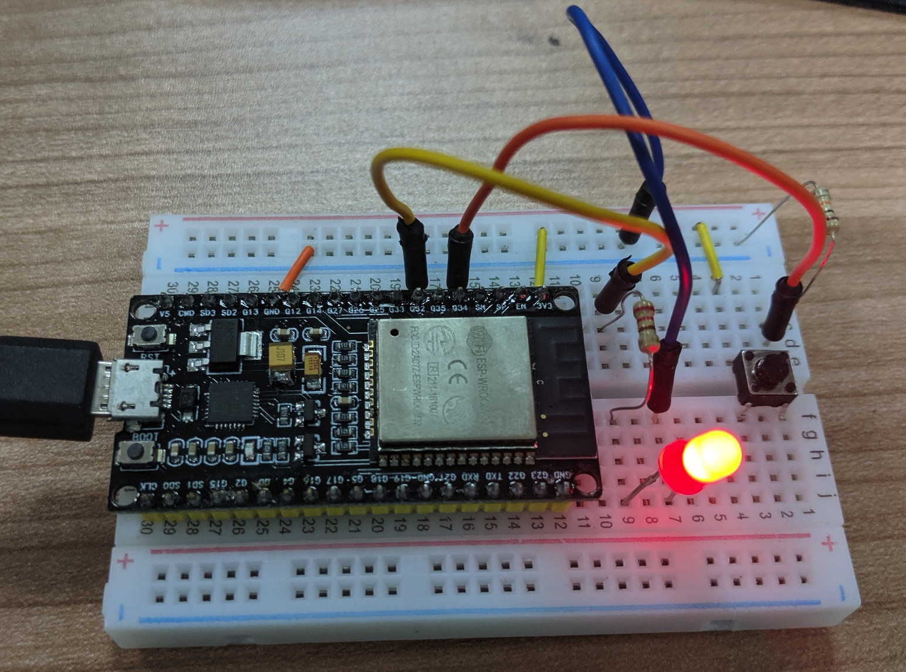
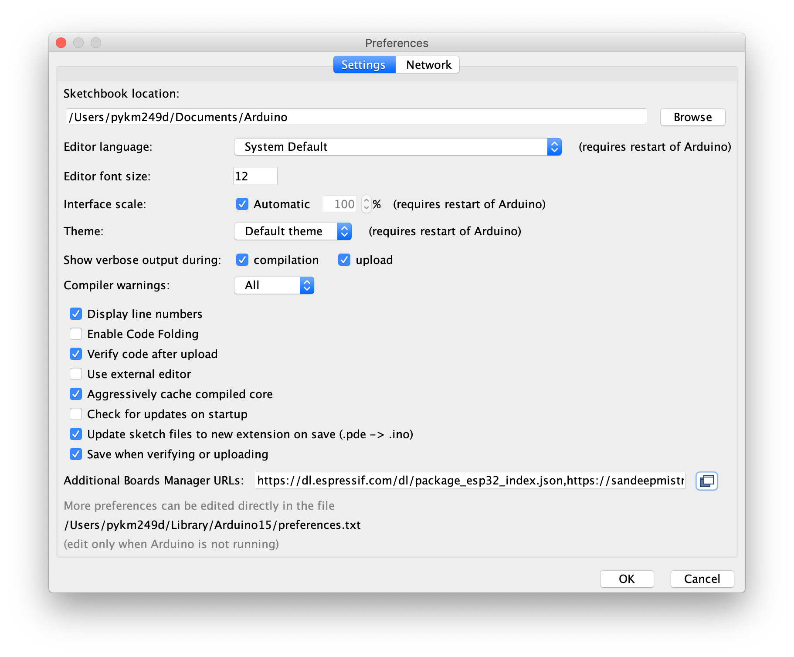
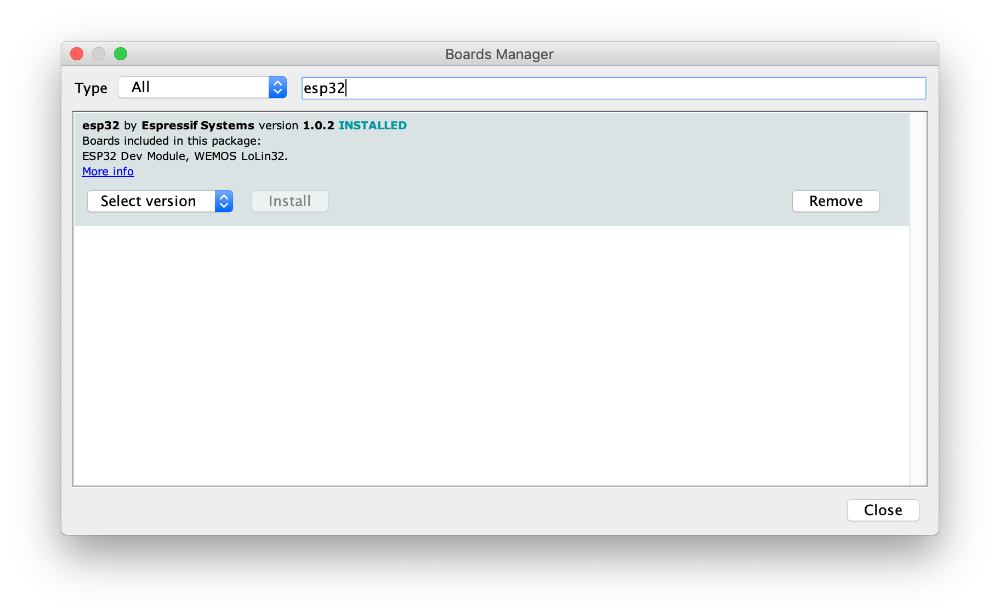

# IoT MCU Workshop

This is an introductory IoT ESP32 Microcontroller workshop to get acquainted with microcontroller programming and simple electronics. 

An ESP32-based microcontroller breakout was chosen as it is Arduino-compatible and has both Wifi and BLE capabilities. 

## Lesson Plan

1. Serial - Setting up of software SDK and testing
2. Blink - Connecting and blinking LED
3. Button - Connecting button and try to detect press
4. Debounce - Concept of input debouncing
5. Post - Posting Request to a server on button press
6. Get - Repeatedly polling the server for on or off instruction

## Install CP2102 drivers, Arduino and ESP32 SDK

0. [Download and install Silabs CP2102 drivers](https://www.silabs.com/products/development-tools/software/usb-to-uart-bridge-vcp-drivers)

1. [Download and install the latest Arduino IDE](https://www.arduino.cc/en/main/software) which is 1.8.9 at time of writing.

2. Configure Arduino Preferences. Click the `Arduino` menu and select `Preferences`. Select the options: 

    * Show verbose output during `compilation` and `upload` 
    * Compiler warnings: `All` 
    * `Display line numbers`
    * `Verify code after upload`
    * Additional Boards Manager URLs: `https://dl.espressif.com/dl/package_esp32_index.json`

3. Download ESP32 Arduino SDK: `Tools -> Board -> Boards Manager`. Search for `ESP32` and install.

## Hardware Required

| Item                 | Price SG$ | Purchase Source                                                          |
|----------------------|-----------|--------------------------------------------------------------------------|
| GOOUUU ESP32 Dev kit | 28        | https://www.sgbotic.com/index.php?dispatch=products.view&product_id=2550 |
| 50cm Micro-USB cable | 3         | https://www.sgbotic.com/index.php?dispatch=products.view&product_id=2338 |
| Half-size breadboard | 6         | https://www.sgbotic.com/index.php?dispatch=products.view&product_id=2556 |
| 5mm Red LED          | 1         | https://www.sgbotic.com/index.php?dispatch=products.view&product_id=1622 |
| 330ohm resistor      | 0.70      | https://www.sgbotic.com/index.php?dispatch=products.view&product_id=791  |
| Push Button          | 0.50      | https://www.sgbotic.com/index.php?dispatch=products.view&product_id=78   |
| 10K ohm resistor     | 0.70      | https://www.sgbotic.com/index.php?dispatch=products.view&product_id=793  |
| Total                | $39.9     |                                                                          |

## Modifying connection diagrams

The connection diagrams were created using Kicad and Fritzing.

DoIT ES32 dev kit Fritzing design was obtained from http://forum.fritzing.org/t/doit-esp32-devkit-v1/6158

